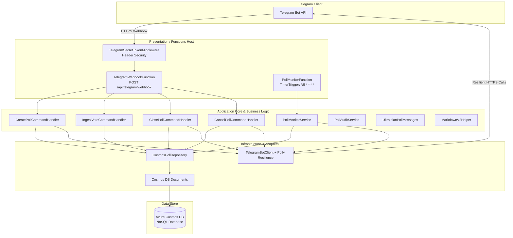

# CalmClass

[](https://dotnet.microsoft.com/)
[](https://learn.microsoft.com/azure/azure-functions/)
[](https://azure.microsoft.com/services/cosmos-db/)
[](https://github.com/thomhurst/TUnit)
[](.editorconfig)
[](LICENSE)

**CalmClass** is a serverless school classroom automation platform for Telegram built on .NET 10, Azure Functions (Isolated Worker), and Azure Cosmos DB. It is designed to eliminate chaotic messaging and administrative fatigue in classroom parent chats through transparent, automated decision polls, participation tracking against classroom rosters, non-intrusive batched reminders with quiet-hours protection, and instant verifiable closures.

---

## Table of Contents

- [Key Capabilities](#key-capabilities)
- [System Architecture](#system-architecture)
- [Bot Commands Reference](#bot-commands-reference)
- [Solution Structure](#solution-structure)
- [Prerequisites](#prerequisites)
- [Quickstart & Local Development](#quickstart--local-development)
  - [1. Clone and Install Dependencies](#1-clone-and-install-dependencies)
  - [2. Start Local Storage Emulators](#2-start-local-storage-emulators)
  - [3. Configure Local Settings](#3-configure-local-settings)
  - [4. Run the Functions Host](#4-run-the-functions-host)
  - [5. Test & Simulate Events Locally](#5-test--simulate-events-locally)
  - [6. Connect Live Telegram Webhook (Optional)](#6-connect-live-telegram-webhook-optional)
- [Configuration Reference](#configuration-reference)
- [Testing & Quality Verification](#testing--quality-verification)
- [Coding Standards & Conventions](#coding-standards--conventions)
- [Specifications & Living Documentation](#specifications--living-documentation)
- [License](#license)

---

## Key Capabilities

- **Transparent Decision Polls**: Initiates non-anonymous votes (`is_anonymous = false`) directly within group chats so member choices can be audited, avoiding duplicate or unverified voting.
- **Idempotent Real-Time Ingestion**: Captures `poll_answer` webhook updates in real-time, accurately recording vote selections, option updates, and vote retractions (empty selections).
- **Roster-Based Participation Tracking**: Compares incoming votes against a pre-registered classroom committee roster (`GroupMember`) to accurately detect unresponsive parents.
- **Automated Batched Reminders**: Scans active polls approaching their deadline (default: 6 hours remaining) and sends a single aggregated reminder pinging all pending members.
- **Anti-Spam & Username Fallback**: Replaces noisy per-user messages with a single batched group ping using `@username` handles or inline markdown links (`[Name](tg://user?id=...)`) for members without public handles.
- **Quiet Hours Protection**: Automatically detects when reminders fire outside daylight hours (20:00–08:00 local time) and delivers notifications silently (`disable_notification = true`) to respect parents' sleep.
- **Automated & Manual Closure**: Automatically closes expired polls upon deadline, stops active voting via the Telegram API (`stopPoll`), and calculates winning options, percentages, and turnout.
- **Single Active Poll Limit**: Enforces a concurrency constraint of at most one active (`Open` or `Reminded`) poll per classroom group at a time.
- **Full Ukrainian Localization**: All end-user notifications, poll templates, error messages, and summary reports are natively localized in Ukrainian.

---

## System Architecture

CalmClass is built according to **Clean Architecture** and Domain-Driven Design principles:



### Architectural Highlights

1. **Presentation Layer (`CalmClass.Functions`)**:
   - Azure Functions v4 on .NET 10 Isolated Worker model.
   - `TelegramSecretTokenMiddleware` validates the `X-Telegram-Bot-Api-Secret-Token` header on all inbound webhook calls before execution.
   - `TelegramWebhookFunction` routes incoming `message` commands and `poll_answer` events.
   - `PollMonitorFunction` runs periodically via a `TimerTrigger` (default: every 5 minutes) to evaluate active polls, fire due reminders, and auto-close expired polls.
2. **Application Core (`CalmClass.Application`)**:
   - Encapsulates pure domain models (`TrackedPoll`, `PollVote`, `GroupMember`), CQRS command handlers, audit services, and localization.
   - Contains zero dependencies on database engines or cloud infrastructure.
3. **Infrastructure Layer (`CalmClass.Infrastructure`)**:
   - Azure Cosmos DB NoSQL client with optimistic concurrency (`ETag`) partitioned by `chatId`.
   - Outbound Telegram API adapter powered by **Polly v8** with jittered exponential backoff respecting Telegram's `retry_after` response headers.

---

## Bot Commands Reference

All commands require authorization; only users registered as committee members or admins in the classroom roster can execute administrative actions.

| Command | Arguments | Permission | Description |
| :--- | :--- | :--- | :--- |
| `/create_poll` | `"Question" "Option 1" "Option 2" ... [hours]` | Admin | Publishes a non-anonymous poll to the group. Duration defaults to 24 hours if omitted. |
| `/close_poll` | *(none)* | Admin | Manually stops the active poll in the chat, tallies current votes, and immediately publishes the final results summary. |
| `/cancel_poll` | *(none)* | Admin | Voids the active poll without tallying results and posts a cancellation notice to the group. |

---

## Solution Structure

```
calm-class/
├── .editorconfig                 # Strict solution-wide code style & formatting rules
├── .specify/                     # Spec-Kit constitution, templates, and living memory
├── docker-compose.yml            # Local development emulators (Azurite & Cosmos DB)
├── Directory.Build.props         # Global MSBuild properties (C# 13 / .NET 10)
├── Directory.Packages.props      # Central Package Management (CPM)
├── scripts/                      # Developer automation and simulation scripts
│   ├── run-local.sh              # Bootstraps prerequisites, builds, and starts Functions host
│   ├── register-webhook.sh       # Registers/queries Telegram webhook with ngrok auto-detection
│   └── simulate-webhook.sh       # Simulates Telegram webhooks (commands, votes, cancellations)
├── specs/                        # Spec-Driven Development documentation
│   └── 001-poll-automator-monitor/
│       ├── spec.md               # Living feature specification & requirements
│       ├── plan.md               # Technical architecture & implementation plan
│       ├── data-model.md         # Database schema & entity mappings
│       ├── contracts/            # Webhook, bot command, and document contracts
│       └── quickstart.md         # Quickstart & verification walkthrough
├── src/
│   ├── CalmClass.Application/    # Clean Architecture: Core domain, CQRS, services, Ukrainian strings
│   ├── CalmClass.Infrastructure/ # Clean Architecture: Cosmos DB repository, Telegram client, Polly
│   └── CalmClass.Functions/      # Azure Functions v4 Host, HTTP webhooks, Timer triggers, Serilog
└── tests/
    └── unit/
        ├── CalmClass.ApplicationTests.Unit/     # TUnit unit tests for commands, audit, and tallies
        └── CalmClass.InfrastructureTests.Unit/  # TUnit unit tests for Cosmos mapping & MarkdownV2
```

---

## Prerequisites

- **[.NET 10 SDK](https://dotnet.microsoft.com/download)** (`dotnet --version` $\ge$ `10.0`)
- **[Azure Functions Core Tools v4](https://learn.microsoft.com/azure/azure-functions/functions-run-local)** (`func --version` $\ge$ `4.x`)
- **[Docker Desktop](https://www.docker.com/products/docker-desktop)** or Docker Engine (for local Azurite / Cosmos DB emulators)
- **[ngrok](https://ngrok.com/)** *(optional, only needed for receiving live Telegram webhook events locally)*

---

## Quickstart & Local Development

### 1. Clone and Install Dependencies

```bash
git clone https://github.com/GorbunowArtem/calm-class.git
cd calm-class
dotnet restore
```

### 2. Start Local Storage Emulators

CalmClass utilizes Azurite for local Azure WebJobs timer state and can use Azure Cosmos DB Linux Emulator:

```bash
# Start Azurite (required for timer triggers and webjobs state)
docker compose up azurite -d

# (Optional) Start Cosmos DB Emulator for full local persistence
docker compose --profile cosmos up -d
```

### 3. Configure Local Settings

Create `local.settings.json` in the Functions project (or let `./scripts/run-local.sh` copy it automatically):

```bash
cp src/CalmClass.Functions/local.settings.example.json src/CalmClass.Functions/local.settings.json
```

Adjust settings in `src/CalmClass.Functions/local.settings.json`:
- `Telegram__BotToken`: Your Telegram Bot API token from [@BotFather](https://t.me/BotFather) (or mock token for local testing).
- `Telegram__SecretToken`: Random alphanumeric string (1–256 chars) used to authenticate incoming webhooks.
- `CosmosDb__ConnectionString`: Connection string to your Azure Cosmos DB account or local emulator.

### 4. Run the Functions Host

Run the automated helper script:

```bash
./scripts/run-local.sh
```

Alternatively, build and start using the .NET CLI:

```bash
dotnet build -m:1 src/CalmClass.Functions/CalmClass.Functions.csproj
cd src/CalmClass.Functions/bin/Debug/net10.0
func start
```

The Functions host will initialize on `http://localhost:7071` with the following active endpoints:
- `POST http://localhost:7071/api/telegram/webhook`
- `TimerTrigger: PollMonitorFunction` (scheduled every 5 minutes)

### 5. Test & Simulate Events Locally

Use `./scripts/simulate-webhook.sh` to simulate Telegram activity without connecting to external Telegram servers:

```bash
# Simulate an admin creating a new poll
./scripts/simulate-webhook.sh create

# Simulate a group member casting a vote (option index 0)
./scripts/simulate-webhook.sh vote 0

# Simulate a group member retracting their vote
./scripts/simulate-webhook.sh retract

# Simulate an admin manually closing the poll
./scripts/simulate-webhook.sh close

# Simulate an admin cancelling the poll
./scripts/simulate-webhook.sh cancel
```

### 6. Connect Live Telegram Webhook (Optional)

To test end-to-end with real Telegram group chats:

1. Start your local Functions host (`./scripts/run-local.sh`).
2. Expose port 7071 to the internet with ngrok:
   ```bash
   ngrok http 7071
   ```
3. Register the webhook with Telegram using the helper script (auto-detects the ngrok tunnel):
   ```bash
   ./scripts/register-webhook.sh
   ```
4. Verify webhook status anytime:
   ```bash
   ./scripts/register-webhook.sh --info
   ```

---

## Configuration Reference

All settings can be provided via `local.settings.json` locally or Azure App Service / Function App Application Settings in production:

| Key | Description | Default |
| :--- | :--- | :--- |
| `AzureWebJobsStorage` | Connection string for Azure WebJobs storage / Azurite | `UseDevelopmentStorage=true` |
| `FUNCTIONS_WORKER_RUNTIME` | Functions isolated worker runtime | `dotnet-isolated` |
| `Telegram__BotToken` | Telegram Bot Token issued by [@BotFather](https://t.me/BotFather) | *(Required)* |
| `Telegram__SecretToken` | Secret token verified in `X-Telegram-Bot-Api-Secret-Token` | *(Required)* |
| `Telegram__BaseUrl` | Telegram Bot API base URL | `https://api.telegram.org` |
| `CosmosDb__ConnectionString` | Azure Cosmos DB NoSQL connection string | *(Required)* |
| `CosmosDb__DatabaseName` | Cosmos DB database name | `CalmClassDb` |
| `CosmosDb__ContainerName` | Cosmos DB container name for polls, votes, and members | `Polls` |
| `QuietHours__StartHour` | Hour (24h format) when quiet hours begin | `20` (8:00 PM) |
| `QuietHours__EndHour` | Hour (24h format) when quiet hours end | `8` (8:00 AM) |
| `QuietHours__TimeZoneId` | IANA or Windows Timezone identifier | `Europe/Kyiv` |
| `Poll__DefaultDurationHours` | Default lifespan of a decision poll if omitted by admin | `24` |
| `Poll__ReminderHoursBeforeExpiry` | Window before poll expiry when reminder is dispatched | `6` |

---

## Testing & Quality Verification

CalmClass utilizes [TUnit](https://github.com/thomhurst/TUnit) and Microsoft Testing Platform for fast, modern unit testing.

### Execute Unit Tests

```bash
# Run Application unit tests (domain entities, CQRS, tallying, reminders, audit)
dotnet build -m:1 tests/unit/CalmClass.ApplicationTests.Unit/CalmClass.ApplicationTests.Unit.csproj
dotnet run --project tests/unit/CalmClass.ApplicationTests.Unit/CalmClass.ApplicationTests.Unit.csproj --no-build

# Run Infrastructure unit tests (Cosmos DB document mappings, MarkdownV2 escaping)
dotnet build -m:1 tests/unit/CalmClass.InfrastructureTests.Unit/CalmClass.InfrastructureTests.Unit.csproj
dotnet run --project tests/unit/CalmClass.InfrastructureTests.Unit/CalmClass.InfrastructureTests.Unit.csproj --no-build
```

### Verify Code Formatting & Style

The solution enforces strict code quality through [.editorconfig](.editorconfig):

```bash
# Verify whitespace rules
dotnet format whitespace --verify-no-changes

# Verify code style rules (including IDE0065, IDE0022, IDE2003)
dotnet format style --verify-no-changes

# Verify analyzer rules
dotnet format analyzers --verify-no-changes
```

---

## Coding Standards & Conventions

CalmClass follows strict C# coding conventions enforced by `.editorconfig` and project governance (`AGENTS.md`):

1. **Primary Constructors (Mandatory)**:
   - All classes requiring dependency injection or initialization parameters must use C# primary constructors.
   - Redundant private backing fields (`private readonly IFoo _foo;`) and underscore prefixes (`_*`) are prohibited.
2. **Concise Positional Records (Mandatory)**:
   - Domain entities, contracts, DTOs, and Cosmos DB document models leverage C# positional `record` types (`record class` or `record struct`) for immutability.
   - Serialization and validation attributes must target properties explicitly: `[property: JsonPropertyName("...")]`.
3. **Using Directive Placement & Sorting (IDE0065 - Mandatory)**:
   - In accordance with `csharp_using_directive_placement = inside_namespace:error`, all `using` directives must be placed inside/below the file-scoped `namespace <Name>;` declaration.
   - Directives are organized with `System` / `System.*` first, followed by third-party and solution namespaces alphabetically (`dotnet_sort_system_directives_first = true`).
   - Top-level statement entry points (e.g. `Program.cs`) are the sole exception.

---

## Specifications & Living Documentation

CalmClass adheres to **Spec-Driven Development (SDD)**:
- Specifications under `specs/` are living source-of-truth documents.
- Any new features, schema modifications, or behavioral nuances are documented in `spec.md` and synced with the as-built code.
- Consult the feature specification in [`specs/001-poll-automator-monitor/spec.md`](specs/001-poll-automator-monitor/spec.md) for full requirement traces, acceptance criteria, and edge cases.

---

## License

This project is licensed under the [MIT License](LICENSE).
