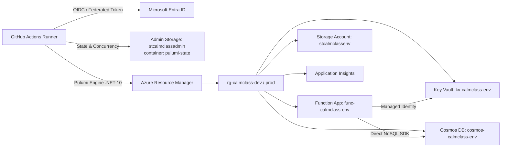

# Azure Portal Setup & Cloud Provisioning Guide

This guide provides step-by-step instructions for configuring Microsoft Azure and GitHub to support automated deployment, Pulumi Infrastructure as Code (IaC), and continuous integration for **CalmClass**.

---

## Table of Contents

- [Overview & Architecture](#overview--architecture)
- [Step 1: Verify Subscription & Resource Providers](#step-1-verify-subscription--resource-providers)
- [Step 2: Create Administrative Storage for Pulumi State](#step-2-create-administrative-storage-for-pulumi-state)
- [Step 3: Register Entra ID Application for GitHub Actions OIDC](#step-3-register-entra-id-application-for-github-actions-oidc)
- [Step 4: Configure Federated Identity Credentials](#step-4-configure-federated-identity-credentials)
- [Step 5: Assign Azure RBAC Roles](#step-5-assign-azure-rbac-roles)
- [Step 6: Configure GitHub Environments, Variables & Secrets](#step-6-configure-github-environments-variables--secrets)
- [Step 7: Verify First-Time Cloud Deployment](#step-7-verify-first-time-cloud-deployment)
- [Troubleshooting & Gotchas](#troubleshooting--gotchas)

---

## Overview & Architecture

CalmClass provisions two completely isolated environments in Azure:
- **`dev`** (`rg-calmclass-dev`): Automated pre-merge deployment target for passing PRs.
- **`prod`** (`rg-calmclass-prod`): Production environment deployed exclusively via manual dispatch after maintainer review.

Each environment contains:
1. **Azure Resource Group** (`rg-calmclass-<env>`)
2. **Storage Account** (`stcalmclass<env>`) for Azure Functions runtime leases and timer trigger locks.
3. **Cosmos DB Serverless Account** (`cosmos-calmclass-<env>`) with database `CalmClassDb` and container `Polls` (`/chatId` partition key).
4. **Azure Key Vault** (`kv-calmclass-<env>`) storing secrets securely.
5. **Log Analytics Workspace & Application Insights** (`appi-calmclass-<env>`) for structured telemetry.
6. **Linux Consumption App Service Plan** (`asp-calmclass-<env>`).
7. **Azure Function App** (`func-calmclass-<env>`) running .NET 10 Isolated Worker with System-Assigned Managed Identity.



---

## Step 1: Verify Subscription & Resource Providers

Before deploying resources, ensure your Azure Subscription has the necessary resource providers registered.

### In Azure Portal:
1. In the top search bar, search for **Subscriptions** and select your target subscription.
2. Note your **Subscription ID** and **Tenant ID** (found on the subscription *Overview* blade).
3. In the left navigation menu, under **Settings**, select **Resource providers**.
4. Check that the following providers show status **Registered**. If any show *NotRegistered*, select the provider and click **Register**:
   - `Microsoft.Resources`
   - `Microsoft.Storage`
   - `Microsoft.DocumentDB`
   - `Microsoft.KeyVault`
   - `Microsoft.Web`
   - `Microsoft.Insights`
   - `Microsoft.OperationalInsights`
   - `Microsoft.Authorization`

### Azure CLI Equivalent:
```bash
az provider register --namespace Microsoft.Resources
az provider register --namespace Microsoft.Storage
az provider register --namespace Microsoft.DocumentDB
az provider register --namespace Microsoft.KeyVault
az provider register --namespace Microsoft.Web
az provider register --namespace Microsoft.Insights
az provider register --namespace Microsoft.OperationalInsights
az provider register --namespace Microsoft.Authorization
```

---

## Step 2: Create Administrative Storage for Pulumi State

Pulumi requires a state backend to store infrastructure state snapshots and concurrency locks. CalmClass uses self-hosted Azure Blob Storage (`azblob://pulumi-state`), avoiding external SaaS dependencies.

### In Azure Portal:
1. **Create Resource Group**:
   - Search for **Resource groups** -> click **+ Create**.
   - **Subscription**: Select your subscription.
   - **Resource group**: `rg-calmclass-admin`.
   - **Region**: `polandcentral` (or your preferred region, e.g. `westeurope`, `northeurope`).
   - Click **Review + create** -> **Create**.
2. **Create Storage Account**:
   - Search for **Storage accounts** -> click **+ Create**.
   - **Resource group**: `rg-calmclass-admin`.
   - **Storage account name**: `stcalmclassadmin` *(must be globally unique, 3–24 lowercase alphanumeric chars; adjust if taken)*.
   - **Region**: Same region as `rg-calmclass-admin`.
   - **Primary service**: *Azure Blob Storage or Azure Data Lake Storage Gen 2*.
   - **Performance**: *Standard*.
   - **Redundancy**: *Locally-redundant storage (LRS)*.
   - Click **Review** -> **Create**.
3. **Create Blob Container for Pulumi State**:
   - Open the newly created storage account (`stcalmclassadmin`).
   - In the left sidebar under **Data storage**, select **Containers**.
   - Click **+ Container**.
   - **Name**: `pulumi-state`.
   - **Public access level**: *Private (no anonymous access)*.
   - Click **Create**.

### Azure CLI Equivalent:
```bash
# 1. Create admin resource group
az group create --name "rg-calmclass-admin" --location "polandcentral"

# 2. Create storage account
az storage account create \
  --name "stcalmclassadmin" \
  --resource-group "rg-calmclass-admin" \
  --location "polandcentral" \
  --sku "Standard_LRS" \
  --allow-blob-public-access false

# 3. Create blob container for state
az storage container create \
  --name "pulumi-state" \
  --account-name "stcalmclassadmin" \
  --auth-mode login
```

---

## Step 3: Register Entra ID Application for GitHub Actions OIDC

To authenticate GitHub Actions pipelines without long-lived client secret passwords, we use Microsoft Entra ID OpenID Connect (OIDC) Workload Identity Federation.

### In Azure Portal:
1. In the top search bar, search for **Microsoft Entra ID**.
2. In the left navigation menu under **Manage**, select **App registrations**.
3. Click **+ New registration**:
   - **Name**: `app-calmclass-cicd`.
   - **Supported account types**: *Accounts in this organizational directory only (Single tenant)*.
   - **Redirect URI**: Leave empty.
   - Click **Register**.
4. On the App Registration **Overview** blade, copy and save:
   - **Application (client) ID**
   - **Directory (tenant) ID**

---

## Step 4: Configure Federated Identity Credentials

Federated credentials establish trust between GitHub Actions and Microsoft Entra ID based on the repository name and workflow context.

### In Azure Portal:
1. In `app-calmclass-cicd`, select **Certificates & secrets** in the left menu.
2. Click the **Federated credentials** tab.
3. Click **+ Add credential**:
    - **Federated credential scenario**: Select **GitHub Actions deploying Azure resources**.
    - **Organization**: `GorbunowArtem` *(or your GitHub organization/username)*.
    - **Repository**: `calm-class`.

> [!NOTE]
> **How to get Organization ID and Repository ID**:  
> In modern Azure Portal interfaces supporting GitHub's immutable subject format, you may be prompted for numeric IDs:
> - **Organization / User ID for `GorbunowArtem`**: `15319213`
> - **Repository ID for `calm-class`**: `1357346431`
>
> You can retrieve or verify these numeric IDs anytime via:
> - **GitHub API in your browser or curl**:
>   - User / Org: `https://api.github.com/users/GorbunowArtem` (look for `"id"`)
>   - Repository: `https://api.github.com/repos/GorbunowArtem/calm-class` (look for `"id"`)
> - **GitHub CLI**:
>   ```bash
>   gh api users/GorbunowArtem --jq .id        # Returns: 15319213
>   gh api repos/GorbunowArtem/calm-class --jq .id # Returns: 1357346431
>   ```

4. Configure **Scenario A: Pull Request Validation & Dev Deploy**:
   - **Entity type**: **Pull request**.
   - **Name**: `gh-actions-calmclass-pr`.
   - **Description**: `GitHub Actions OIDC for pull requests (Dev preview and deploy)`.
   - The Subject identifier is automatically generated: `repo:GorbunowArtem/calm-class:pull_request`.
   - Click **Add**.
5. Click **+ Add credential** again for **Scenario B: Production Release**:
   - **Federated credential scenario**: **GitHub Actions deploying Azure resources**.
   - **Organization**: `GorbunowArtem`.
   - **Repository**: `calm-class`.
   - **Entity type**: **Environment**.
   - **Environment name**: `prod`.
   - **Name**: `gh-actions-calmclass-prod`.
   - **Description**: `GitHub Actions OIDC for manual production release`.
   - Subject identifier: `repo:GorbunowArtem/calm-class:environment:prod`.
   - Click **Add**.
6. *(Recommended)* Click **+ Add credential** for **Scenario C: Main Branch (Direct Dispatch)**:
   - **Entity type**: **Branch**.
   - **Branch name**: `main`.
   - **Name**: `gh-actions-calmclass-main`.
   - **Description**: `GitHub Actions OIDC for main branch dispatch`.
   - Subject identifier: `repo:GorbunowArtem/calm-class:ref:refs/heads/main`.
   - Click **Add**.

### Azure CLI Equivalent:
```bash
APP_ID=$(az ad app list --display-name "app-calmclass-cicd" --query "[0].appId" -o tsv)

# Pull request credential
az ad app federated-credential create --id "$APP_ID" --parameters '{
  "name": "gh-actions-calmclass-pr",
  "issuer": "https://token.actions.githubusercontent.com",
  "subject": "repo:GorbunowArtem/calm-class:pull_request",
  "description": "GitHub Actions PR validation and dev deployment",
  "audiences": ["api://AzureADTokenExchange"]
}'

# Prod environment credential
az ad app federated-credential create --id "$APP_ID" --parameters '{
  "name": "gh-actions-calmclass-prod",
  "issuer": "https://token.actions.githubusercontent.com",
  "subject": "repo:GorbunowArtem/calm-class:environment:prod",
  "description": "GitHub Actions production release",
  "audiences": ["api://AzureADTokenExchange"]
}'

# Main branch credential
az ad app federated-credential create --id "$APP_ID" --parameters '{
  "name": "gh-actions-calmclass-main",
  "issuer": "https://token.actions.githubusercontent.com",
  "subject": "repo:GorbunowArtem/calm-class:ref:refs/heads/main",
  "description": "GitHub Actions main branch dispatch",
  "audiences": ["api://AzureADTokenExchange"]
}'
```

---

## Step 5: Assign Azure RBAC Roles

The App Registration requires permissions across the subscription to provision resources, manage state in the administrative storage account, and assign the `Key Vault Secrets User` role to the Function App's Managed Identity.

### Required Roles:
| Role | Scope | Purpose |
| :--- | :--- | :--- |
| **Contributor** | Subscription | Create and manage resource groups, Cosmos DB, Key Vault, Storage, App Service Plans, and Function Apps. |
| **Role Based Access Control Administrator** *(or User Access Administrator)* | Subscription | Allows Pulumi to grant the Function App's Managed Identity the `Key Vault Secrets User` role on the Key Vault. |
| **Storage Blob Data Contributor** | `rg-calmclass-admin` (or Subscription) | Read, write, and lock state blobs in `stcalmclassadmin/pulumi-state`. |

### In Azure Portal:

#### 1. Assign Contributor & RBAC Administrator on Subscription:
1. Navigate to **Subscriptions** -> select your subscription.
2. Click **Access control (IAM)** in the left menu.
3. Click **+ Add** -> **Add role assignment**:
   - **Role**: Select **Contributor**.
   - Click **Next**.
   - **Assign access to**: *User, group, or service principal*.
   - Click **+ Select members** -> search for `app-calmclass-cicd` -> select it -> click **Select**.
   - Click **Review + assign** -> **Review + assign**.
4. Repeat role assignment for role: **Role Based Access Control Administrator** (or **User Access Administrator** if your organization policy mandates it):
   - Click **+ Add** -> **Add role assignment**.
   - **Role**: Select **Role Based Access Control Administrator**.
   - Select member: `app-calmclass-cicd`.
   - Click **Review + assign**.

#### 2. Assign Storage Blob Data Contributor on Admin Storage:
1. Navigate to **Resource groups** -> `rg-calmclass-admin`.
2. Click **Access control (IAM)** -> **+ Add** -> **Add role assignment**.
3. **Role**: Select **Storage Blob Data Contributor**.
4. Select member: `app-calmclass-cicd`.
5. Click **Review + assign**.

### Azure CLI Equivalent:
```bash
SUBSCRIPTION_ID=$(az account show --query "id" -o tsv)
SP_OBJECT_ID=$(az ad sp list --filter "appId eq '$APP_ID'" --query "[0].id" -o tsv)

# Assign Contributor on Subscription
az role assignment create \
  --assignee-object-id "$SP_OBJECT_ID" \
  --assignee-principal-type "ServicePrincipal" \
  --role "Contributor" \
  --scope "/subscriptions/$SUBSCRIPTION_ID"

# Assign Role Based Access Control Administrator on Subscription
az role assignment create \
  --assignee-object-id "$SP_OBJECT_ID" \
  --assignee-principal-type "ServicePrincipal" \
  --role "Role Based Access Control Administrator" \
  --scope "/subscriptions/$SUBSCRIPTION_ID"

# Assign Storage Blob Data Contributor on Admin Resource Group
az role assignment create \
  --assignee-object-id "$SP_OBJECT_ID" \
  --assignee-principal-type "ServicePrincipal" \
  --role "Storage Blob Data Contributor" \
  --scope "/subscriptions/$SUBSCRIPTION_ID/resourceGroups/rg-calmclass-admin"
```

---

## Step 6: Configure GitHub Environments, Variables & Secrets

Now configure GitHub with the Azure IDs and your Telegram Bot credentials.

### 1. Repository Variables (Non-sensitive)
Navigate to **Settings** -> **Secrets and variables** -> **Actions** -> **Variables** tab:
Click **New repository variable** for each:
- `AZURE_CLIENT_ID`: The `Application (client) ID` from Step 3.
- `AZURE_TENANT_ID`: The `Directory (tenant) ID` from Step 1 & 3.
- `AZURE_SUBSCRIPTION_ID`: Your Azure `Subscription ID` from Step 1.
- `AZURE_STORAGE_ACCOUNT`: `stcalmclassadmin` (the administrative storage account from Step 2).

### 2. GitHub Environments Setup
Navigate to **Settings** -> **Environments**:

#### Environment: `dev`
1. Click **New environment** -> Name: `dev` -> **Configure environment**.
2. **Deployment protection rules**: Leave *Required reviewers* **unchecked** (development deployments occur automatically upon passing PR checks).
3. Under **Environment secrets**, click **Add secret**:
   - `TELEGRAM_BOT_TOKEN`: The bot token for your development bot (from [@BotFather](https://t.me/BotFather)).
   - `TELEGRAM_SECRET_TOKEN`: A random alphanumeric token (1–256 chars, e.g. `DevSecretToken2026Secure`).

#### Environment: `prod`
1. Click **New environment** -> Name: `prod` -> **Configure environment**.
2. **Deployment protection rules**:
   - Check **Required reviewers**.
   - Add maintainer usernames who are authorized to review and approve production releases.
   - *(Optional)* Check **Prevent self-review** to require two-person verification.
3. Under **Environment secrets**, click **Add secret**:
   - `TELEGRAM_BOT_TOKEN`: The production bot token (from [@BotFather](https://t.me/BotFather)).
   - `TELEGRAM_SECRET_TOKEN`: A secure random alphanumeric string for production webhook authentication.

---

## Step 7: Verify First-Time Cloud Deployment

### 1. Test Development Deployment via Pull Request
1. Create a feature branch:
   ```bash
   git checkout -b test/verify-azure-cloud
   git commit --allow-empty -m "ci: trigger dev verification deployment"
   git push origin test/verify-azure-cloud
   ```
2. Open a Pull Request on GitHub.
3. Observe GitHub Actions:
   - `validate-and-test`: Executes audit, builds solution, runs all unit tests.
   - `pulumi-preview`: Logs in via Azure OIDC, generates preview for stack `dev`.
   - `deploy-dev`: Reconciles `rg-calmclass-dev`, deploys `func-calmclass-dev`, and registers the Telegram webhook.
4. Verify in Azure Portal:
   - Search for **Resource groups** -> open `rg-calmclass-dev`.
   - Verify all 7 resources are present: Storage account, Cosmos DB, Key Vault, Log Analytics, Application Insights, App Service Plan, and Function App.
   - In Function App `func-calmclass-dev` -> **Configuration** / **Environment variables**: check that Key Vault references (`@Microsoft.KeyVault(...)`) show green checkmarks indicating resolved secrets.

### 2. Test Production Release via Manual Workflow Dispatch
1. Merge the Pull Request into `main`.
2. Navigate to GitHub -> **Actions** -> **Production Release** workflow.
3. Click **Run workflow** on `main`.
4. Observe that the workflow halts at the `deploy-prod` job with status **Waiting for review**.
5. Click **Review deployments** -> select `prod` -> click **Approve and deploy**.
6. The job resumes, executes `pulumi up --stack prod --yes`, deploys the zip artifact to `func-calmclass-prod`, and updates the production Telegram webhook.

---

## Troubleshooting & Gotchas

### 1. Error: `AuthorizationFailed` when Pulumi creates Key Vault role assignment
- **Cause**: The App Registration only has `Contributor` role, which does not permit creating role assignments (`Microsoft.Authorization/roleAssignments/write`).
- **Fix**: Grant `Role Based Access Control Administrator` or `User Access Administrator` on the Subscription scope (see [Step 5](#step-5-assign-azure-rbac-roles)).

### 2. Error: `azblob://` state backend access denied / 403 Forbidden
- **Cause**: The runner is authenticated to Azure, but missing data-plane permissions on the blob storage container.
- **Fix**: Assign the `Storage Blob Data Contributor` role on `rg-calmclass-admin` or the storage account `stcalmclassadmin` to `app-calmclass-cicd`.

### 3. Key Vault Reference shows "SecretNotFound" or "AccessDenied" in Function App
- **Cause**: The System-Assigned Managed Identity of `func-calmclass-<env>` has not yet propagated its RBAC role, or the secret name in Key Vault differs.
- **Fix**: In Azure Portal, open the Key Vault -> **Access Control (IAM)**. Verify `func-calmclass-<env>` has `Key Vault Secrets User`. Restart the Function App.

### 4. Telegram Webhook Error: `HTTPS url must be provided`
- **Cause**: The Function App hostname must resolve over valid HTTPS.
- **Fix**: Azure Functions automatically provides a trusted DigiCert certificate on `*.azurewebsites.net`. Ensure DNS has propagated (Pulumi waits for Function App provisioning completion before registering webhooks).

### 5. Pulumi Resource Name Conflicts
- **Cause**: Global Azure names (Storage Accounts, Key Vaults) must be globally unique across all Azure customers.
- **Fix**: If `stcalmclassdev` or `kv-calmclass-dev` is already taken in Azure, update the prefix in `infra/CalmClass.IaC/Pulumi.dev.yaml` or `Pulumi.prod.yaml` (`calmclass:resourcePrefix: calmclass<unique_suffix>`).
