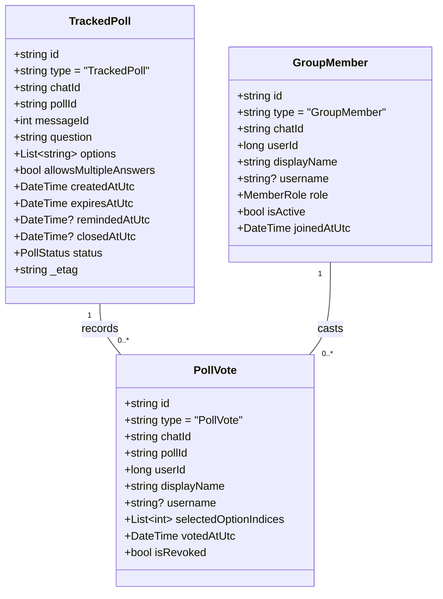
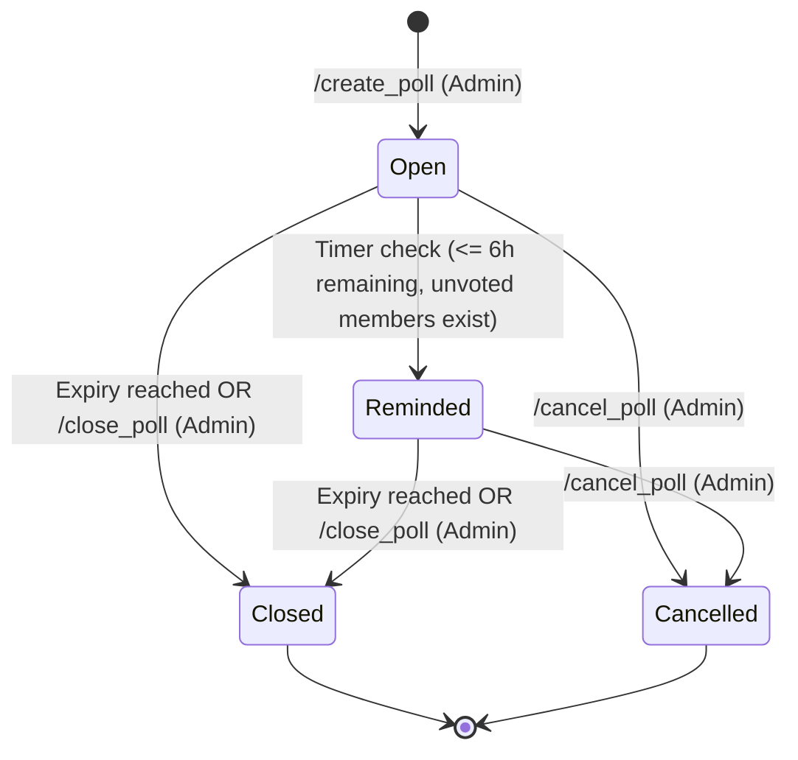

# Data Model: Non-Anonymous Poll Automator & Follow-Up Monitor

**Feature**: `specs/001-poll-automator-monitor`  
**Status**: Completed  
**Date**: 2026-09-04  

---

## 1. Storage Architecture & Container Design

All entities belong to the Azure Cosmos DB container `Polls` under a shared partition key `/chatId`. Documents are discriminated by the `type` property.

---

## 2. Entities & Schemas

> [!IMPORTANT]
> **Implementation Convention**: All domain entities (`TrackedPoll`, `PollVote`, `GroupMember`), Cosmos DB document models, and DTOs must be implemented as C# `record` types (`public record ...`) with immutable properties (`init`) where possible to enforce value equality and immutability.

### 2.1 TrackedPoll
Represents a scheduled transparent decision poll in a Telegram group chat.

- **Document ID (`id`)**: `$"poll_{pollId}"`
- **Partition Key (`chatId`)**: Telegram group chat identifier as string (e.g. `"-1001234567890"`).
- **Type (`type`)**: Constant string `"TrackedPoll"`.
- **Fields**:
  - `pollId` (`string`): Telegram-issued unique poll identifier.
  - `messageId` (`int`): Telegram message identifier of the poll in the chat.
  - `question` (`string`): The poll question text ($1 \le \text{length} \le 300$).
  - `options` (`IReadOnlyList<string>`): List of voting choices ($2 \le \text{count} \le 10$, each $1 \le \text{length} \le 100$).
  - `allowsMultipleAnswers` (`bool`): Whether voters can select multiple choices (defaults to `false`).
  - `createdAtUtc` (`DateTime`): Timestamp when the poll was initiated.
  - `expiresAtUtc` (`DateTime`): Scheduled closing timestamp (defaults to `createdAtUtc + 24 hours`).
  - `remindedAtUtc` (`DateTime?`): Timestamp when the 6-hour unvoted reminder was sent, or `null`.
  - `closedAtUtc` (`DateTime?`): Timestamp when the poll was finalized or cancelled, or `null`.
  - `status` (`PollStatus` enum): Current lifecycle state (`Open`, `Reminded`, `Closed`, `Cancelled`).
  - `_etag` (`string`): Cosmos DB system concurrency token for optimistic updates.

### 2.2 PollVote
Represents the latest voting state of an individual member for a specific poll.

- **Document ID (`id`)**: `$"vote_{pollId}_{userId}"`
- **Partition Key (`chatId`)**: Same as the poll's `chatId`.
- **Type (`type`)**: Constant string `"PollVote"`.
- **Fields**:
  - `pollId` (`string`): Reference to the parent `TrackedPoll.pollId`.
  - `userId` (`long`): Telegram user identifier of the voter.
  - `displayName` (`string`): First name (and last name if available) of the voter.
  - `username` (`string?`): Public Telegram `@username` without the `@` symbol, if set.
  - `selectedOptionIndices` (`IReadOnlyList<int>`): Zero-based indices of chosen options. Empty if revoked.
  - `votedAtUtc` (`DateTime`): Timestamp of the voting or retraction action.
  - `isRevoked` (`bool`): `true` if the member retracted their vote; `false` if active.

### 2.3 GroupMember
Represents a parent or committee member in the classroom group roster.

- **Document ID (`id`)**: `$"member_{chatId}_{userId}"`
- **Partition Key (`chatId`)**: Telegram group chat identifier.
- **Type (`type`)**: Constant string `"GroupMember"`.
- **Fields**:
  - `userId` (`long`): Telegram user identifier.
  - `displayName` (`string`): Member name.
  - `username` (`string?`): Public Telegram username, if available.
  - `role` (`MemberRole` enum): `Admin` (committee member) or `Member` (standard parent).
  - `isActive` (`bool`): Whether the member is actively enrolled in the classroom roster.
  - `joinedAtUtc` (`DateTime`): Enrollment timestamp.

---

## 3. Lifecycle & State Transitions

### Transition Invariants
1. **Single Active Poll per Group**: A new `TrackedPoll` can only transition to `Open` if no poll in the partition currently has `status == Open` or `status == Reminded`.
2. **Reminder Trigger**: Exactly one reminder transition (`Open` $\rightarrow$ `Reminded`) is permitted. If all active roster members have already voted, the state remains `Open` and no reminder message is dispatched.
3. **Closure Finality**: Once `status == Closed` or `status == Cancelled`, no further state transitions are permitted, and incoming `poll_answer` events are ignored.

---

## 4. Validation Rules

| Entity | Field | Rule | Error Action |
|--------|-------|------|--------------|
| `TrackedPoll` | `options` | Minimum 2, maximum 10 items | Reject `/create_poll` with usage instructions |
| `TrackedPoll` | `expiresAtUtc` | Must be between 1 and 168 hours from `createdAtUtc` | Defaults to 24h if omitted; reject if out of range |
| `TrackedPoll` | Concurrency | `COUNT(status in (Open, Reminded)) == 0` | Reject `/create_poll` with conflict warning |
| `PollVote` | `selectedOptionIndices` | Indices must be valid indices in `TrackedPoll.options` | Reject/drop malformed update |
| `PollVote` | `isRevoked` | `selectedOptionIndices.Count == 0` | Mark `isRevoked = true`, include in pending reminders |
| `GroupMember` | `role` | Must be `Admin` to invoke `/create_poll`, `/close_poll`, `/cancel_poll` | Reject with unauthorized message |
