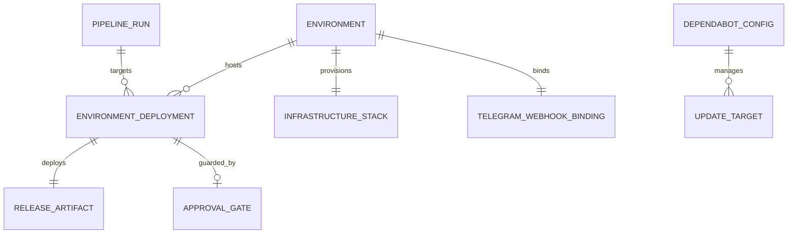
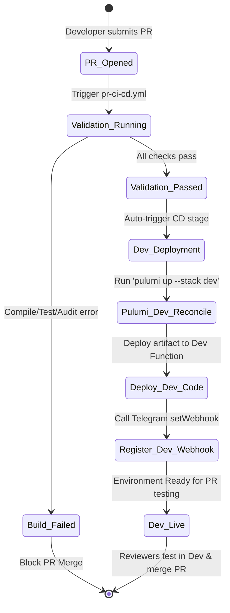
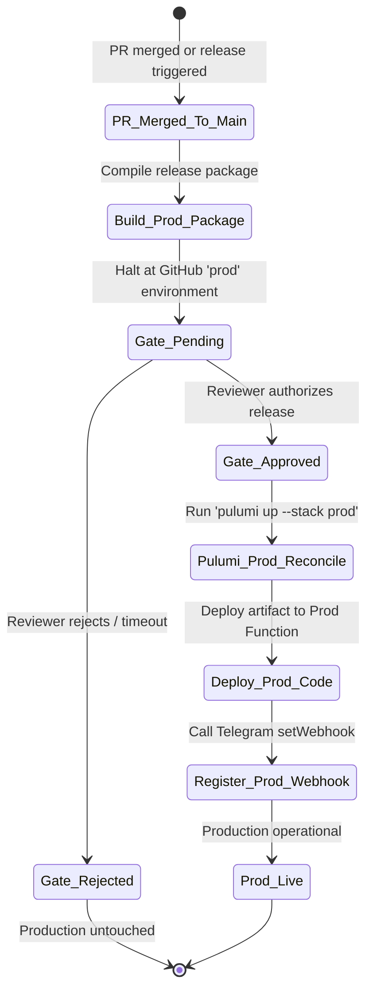

# Data Model & Configuration Schemas: Azure CI/CD Pipeline & Pulumi IaC

**Feature**: `specs/002-azure-cicd-pulumi`  
**Date**: 2026-09-06  
**Status**: Completed  

---

## 1. Entity Model Overview

This data model defines the core entities, configuration contracts, and lifecycle state machines governing the CI/CD pipeline, Pulumi infrastructure definitions, environment isolation, and automated maintenance.

---

## 2. Core Entities

### 2.1 PipelineRun

Represents a single execution of a continuous integration or continuous deployment workflow in GitHub Actions.

| Attribute | Type | Description |
| :--- | :--- | :--- |
| `RunId` | `string` | Unique GitHub Actions workflow run identifier. |
| `TriggerEvent` | `string` | Event triggering the run: `pull_request`, `push`, `workflow_dispatch`. |
| `Branch` | `string` | Source git branch name (e.g. `feat/add-poll`, `main`). |
| `CommitSha` | `string` | Git commit SHA validated or deployed. |
| `Status` | `string` | `Queued`, `InProgress`, `Passed`, `Failed`, `Cancelled`. |
| `CreatedAtUtc` | `DateTime` | Timestamp when the pipeline run was queued. |
| `CompletedAtUtc` | `DateTime?` | Timestamp when all pipeline jobs concluded. |

---

### 2.2 Environment

Represents an isolated Microsoft Azure deployment target with its own cloud resource group, dedicated data store, secret vault, and access policies.

| Attribute | Type | Description |
| :--- | :--- | :--- |
| `EnvironmentName` | `string` | Name of the environment: `dev` or `prod`. |
| `ResourceGroupName` | `string` | Azure Resource Group (e.g. `rg-calmclass-dev`, `rg-calmclass-prod`). |
| `Location` | `string` | Azure region (e.g. `polandcentral`, `westeurope`). |
| `StackName` | `string` | Pulumi stack name corresponding to this environment (`dev`, `prod`). |
| `FunctionAppName` | `string` | Name of the Azure Function App host. |
| `RequiresApproval` | `bool` | `false` for `dev`; `true` for `prod`. |

---

### 2.3 InfrastructureStack (Pulumi)

The declared cloud resource topology managed as code by Pulumi in C# with the Azure Native provider.

| Resource Component | Pulumi Azure Native Type | Configuration Parameters |
| :--- | :--- | :--- |
| **ResourceGroup** | `resources.ResourceGroup` | `ResourceGroupName`, `Location`, `Tags`. |
| **StorageAccount** | `storage.StorageAccount` | `SkuName: Standard_LRS`, `Kind: StorageV2`, `EnableHttpsTrafficOnly: true`. |
| **BlobContainer (State)** | `storage.BlobContainer` | Container name `pulumi-state` for stack backend state. |
| **CosmosDBAccount** | `documentdb.DatabaseAccount` | `DatabaseAccountOfferType: Standard`, `Capabilities: EnableServerless`, `Locations`. |
| **CosmosSqlDatabase** | `documentdb.SqlResourceSqlDatabase` | `DatabaseName: "CalmClassDb"`. |
| **CosmosSqlContainer** | `documentdb.SqlResourceSqlContainer` | `ContainerName: "Polls"`, `PartitionKey: { Paths = ["/chatId"], Kind = "Hash" }`. |
| **KeyVault** | `keyvault.Vault` | `Sku: standard`, `EnableRbacAuthorization: true`, `SoftDeleteRetentionInDays: 7`. |
| **LogAnalyticsWorkspace**| `operationalinsights.Workspace` | `Sku: PerGB2018`, `RetentionInDays: 30`. |
| **ApplicationInsights** | `insights.Component` | `ApplicationType: web`, `Kind: web`, `WorkspaceResourceId`. |
| **AppServicePlan** | `web.AppServicePlan` | `Sku: Consumption (Y1)`, `Reserved: true` (Linux). |
| **FunctionApp** | `web.WebApp` | `Kind: functionapp,linux`, `Runtime: dotnet-isolated`, `Version: 10.0`, `Identity: SystemAssigned`. |

---

### 2.4 ReleaseArtifact

The immutable, compiled zip package generated by `dotnet publish` and deployed to the Azure Function App.

| Attribute | Type | Description |
| :--- | :--- | :--- |
| `ArtifactId` | `string` | Release artifact name/tag: `calmclass-functions-<commit-sha>.zip`. |
| `CommitSha` | `string` | Source commit from which the binary package was compiled. |
| `Runtime` | `string` | `dotnet-isolated net10.0`. |
| `FileSizeBytes` | `long` | Size of the packaged zip bundle in bytes. |
| `Checksum` | `string` | SHA256 checksum verifying package integrity. |

---

### 2.5 ApprovalGate

The manual authorization checkpoint configured within GitHub Environment protection rules that guards the production environment.

| Attribute | Type | Description |
| :--- | :--- | :--- |
| `Environment` | `string` | Target environment (`prod`). |
| `RequestedAtUtc` | `DateTime` | Timestamp when the deployment halted for approval. |
| `Reviewer` | `string?` | GitHub handle of the authorized approver. |
| `Decision` | `string` | `Pending`, `Approved`, `Rejected`, `TimedOut`. |
| `DecisionAtUtc` | `DateTime?` | Timestamp when the reviewer granted or rejected approval. |

---

### 2.6 TelegramWebhookBinding

Represents the active registration binding between Telegram Bot API and the deployed Azure Function App.

| Attribute | Type | Description |
| :--- | :--- | :--- |
| `TargetEnvironment` | `string` | `dev` or `prod`. |
| `WebhookUrl` | `string` | Public HTTPS endpoint: `https://<func-app-name>.azurewebsites.net/api/telegram/webhook`. |
| `SecretTokenHeader` | `string` | Value passed in `X-Telegram-Bot-Api-Secret-Token` for payload authenticity. |
| `AllowedUpdates` | `string[]` | `["message", "poll_answer"]`. |
| `LastRegisteredAtUtc` | `DateTime` | Timestamp of the most recent successful `setWebhook` API call. |

---

### 2.7 DependabotConfig

Represents the declared schedule and package ecosystem rules in `.github/dependabot.yml`.

| Ecosystem | Directory | Schedule | Target Branch | Purpose |
| :--- | :--- | :--- | :--- | :--- |
| `nuget` | `/` | Weekly | `main` | Updates application and Pulumi C# NuGet packages in `Directory.Packages.props`. |
| `github-actions` | `/` | Weekly | `main` | Updates GitHub Actions workflow action versions in `.github/workflows/`. |

---

## 3. Lifecycle State Machines

### 3.1 Pull Request & Dev Deployment Lifecycle

---

### 3.2 Production Release & Approval Lifecycle

