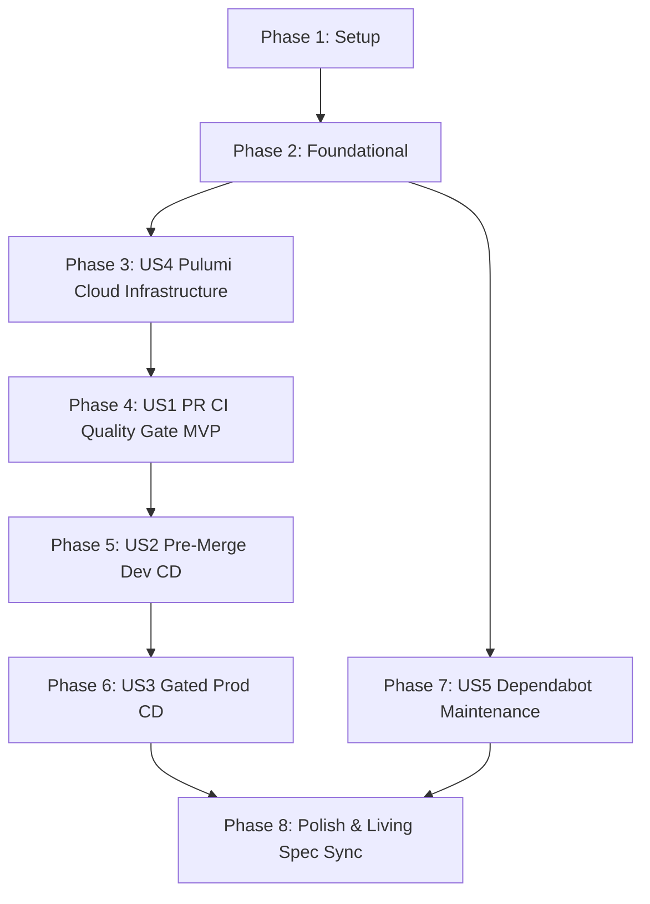

# Tasks: Azure CI/CD Pipeline & Pulumi Infrastructure as Code

**Feature Directory**: `specs/002-azure-cicd-pulumi`  
**Date**: 2026-09-06  
**Status**: Ready for Implementation  
**Specification**: [specs/002-azure-cicd-pulumi/spec.md](spec.md)  
**Implementation Plan**: [specs/002-azure-cicd-pulumi/plan.md](plan.md)  

---

## Phase 1: Setup (Shared Infrastructure & Dependencies)

**Purpose**: Solution initialization, Central Package Management versions, and project scaffolding for Infrastructure as Code.

- [X] T001 Add `Pulumi` and `Pulumi.AzureNative` central package versions in `Directory.Packages.props`
- [X] T002 [P] Register `infra/CalmClass.IaC/CalmClass.IaC.csproj` under `/infra/` solution folder in `CalmClass.slnx`
- [X] T003 [P] Create Pulumi C# project file `infra/CalmClass.IaC/CalmClass.IaC.csproj` targeting `net10.0` with Pulumi package references

---

## Phase 2: Foundational (Pulumi Project Skeleton & State Backend)

**Purpose**: Core Pulumi program initialization and Azure Blob Storage state backend configuration.

**⚠️ CRITICAL**: Must complete before user story infrastructure and workflow definitions can be deployed.

- [X] T004 Create Pulumi project metadata and Azure Blob backend configuration (`azblob://pulumi-state`) in `infra/CalmClass.IaC/Pulumi.yaml`
- [X] T005 [P] Implement C# entry point executing `Deployment.RunAsync<CalmClassStack>()` in `infra/CalmClass.IaC/Program.cs`
- [X] T006 [P] Create strongly typed stack outputs positional record in `infra/CalmClass.IaC/StackOutputs.cs`

**Checkpoint**: Foundation ready — Pulumi C# project compiles and connects to the Azure Blob Storage state backend.

---

## Phase 3: User Story 4 - Reproducible Cloud Infrastructure via Pulumi (Priority: P2)

**Goal**: Declare the complete topology of Azure resources (Resource Group, Storage Account, Cosmos DB, Key Vault, Application Insights, App Service Plan, Function App) as code in C# with distinct stacks for `dev` and `prod`.

**Independent Test**: Run `pulumi preview --stack dev` from `infra/CalmClass.IaC/` and confirm that Pulumi generates the resource plan for all 7 Azure resources without syntax or reference errors.

### Implementation for User Story 4

- [X] T007 [P] [US4] Define development stack configuration parameters in `infra/CalmClass.IaC/Pulumi.dev.yaml`
- [X] T008 [P] [US4] Define production stack configuration parameters in `infra/CalmClass.IaC/Pulumi.prod.yaml`
- [X] T009 [US4] Implement Resource Group (`rg-calmclass-<env>`) and Storage Account (`stcalmclass<env>`) in `infra/CalmClass.IaC/CalmClassStack.cs`
- [X] T010 [US4] Implement Serverless Cosmos DB Account, `CalmClassDb` database, and `Polls` container with partition key `/chatId` in `infra/CalmClass.IaC/CalmClassStack.cs`
- [X] T011 [US4] Implement Azure Key Vault with RBAC authorization and secret storage in `infra/CalmClass.IaC/CalmClassStack.cs`
- [X] T012 [US4] Implement Log Analytics Workspace and Application Insights component in `infra/CalmClass.IaC/CalmClassStack.cs`
- [X] T013 [US4] Implement Linux Consumption App Service Plan and Azure Function App (.NET 10 Isolated) with Managed Identity and Key Vault references in `infra/CalmClass.IaC/CalmClassStack.cs`

**Checkpoint**: User Story 4 complete — cloud infrastructure is fully reproducible and validated via `pulumi preview`.

---

## Phase 4: User Story 1 - Automated Pull Request Validation & Quality Gate (Priority: P1) 🎯 MVP

**Goal**: Implement continuous integration that automatically validates all pull requests targeting `main` with Clean Code auditing, .NET compilation, unit test execution, and a dry-run Pulumi infrastructure preview.

**Independent Test**: Open a pull request targeting `main`. Verify that the GitHub Actions workflow triggers, executes code audits, compiles the solution, runs unit tests via `dotnet exec`, and publishes a Pulumi preview diff on the PR.

### Implementation for User Story 1

- [X] T014 [P] [US1] Define PR trigger, OIDC permissions, and concurrency group in `.github/workflows/pr-ci-cd.yml`
- [X] T015 [US1] Implement `validate-and-test` job running Clean Code audit (`audit.py`), .NET 10 compilation, and unit tests via direct `dotnet exec` in `.github/workflows/pr-ci-cd.yml`
- [X] T016 [US1] Implement `pulumi-preview` job authenticating via Azure OIDC and executing `pulumi preview --stack dev` in `.github/workflows/pr-ci-cd.yml`

**Checkpoint**: User Story 1 (MVP) is operational — every PR is audited, tested, and previewed automatically.

---

## Phase 5: User Story 2 - Pre-Merge Continuous Deployment to Development Environment (Priority: P1)

**Goal**: Automatically compile, package, and deploy the release artifact to the `dev` Azure Function App directly from the passing PR branch, reconciling infrastructure and registering the Telegram webhook.

**Independent Test**: Push a commit to a PR branch. Once validation checks pass, verify that `deploy-dev` executes `pulumi up --stack dev --yes`, deploys the function zip, registers the `dev` Telegram webhook, and reports success.

### Implementation for User Story 2

- [X] T017 [US2] Implement `deploy-dev` job definition with `dev` environment binding and artifact publish/zip steps in `.github/workflows/pr-ci-cd.yml`
- [X] T018 [US2] Add Pulumi infrastructure reconciliation step (`pulumi up --stack dev --yes`) to `deploy-dev` in `.github/workflows/pr-ci-cd.yml`
- [X] T019 [US2] Add Azure Functions zip deployment step (`az functionapp deployment source config-zip`) to `deploy-dev` in `.github/workflows/pr-ci-cd.yml`
- [X] T020 [US2] Implement post-deployment Telegram webhook registration step with exponential retry in `.github/workflows/pr-ci-cd.yml`

**Checkpoint**: User Story 2 complete — passing PRs automatically deploy to `dev` for pre-merge cloud testing.

---

## Phase 6: User Story 3 - Gated Production Deployment with Manual Approval (Priority: P1)

**Goal**: Package the release artifact on manual workflow dispatch from `main`, halt at the GitHub Environment `prod` manual approval gate, and upon authorized review, deploy infrastructure and application code to production and register the production Telegram webhook without any automatic triggers.

**Independent Test**: Manually trigger the production workflow via `workflow_dispatch` from `main`. Confirm the deployment halts in `Waiting for review` on `prod`. Approve the deployment in GitHub and verify that `pulumi up --stack prod --yes`, Function zip deployment, and webhook registration complete successfully.

### Implementation for User Story 3

- [X] T021 [P] [US3] Create production release workflow skeleton with manual workflow_dispatch trigger only (no automatic trigger) and concurrency in `.github/workflows/prod-deploy.yml`
- [X] T022 [US3] Implement `build-package` job compiling Functions and uploading release artifact in `.github/workflows/prod-deploy.yml`
- [X] T023 [US3] Implement `deploy-prod` job guarded by `prod` environment manual approval gate in `.github/workflows/prod-deploy.yml`
- [X] T024 [US3] Add Pulumi infrastructure reconciliation step (`pulumi up --stack prod --yes`) to `deploy-prod` in `.github/workflows/prod-deploy.yml`
- [X] T025 [US3] Add Azure Functions zip deployment step for `func-calmclass-prod` in `.github/workflows/prod-deploy.yml`
- [X] T026 [US3] Add post-deployment production Telegram webhook registration step in `.github/workflows/prod-deploy.yml`

**Checkpoint**: User Story 3 complete — production deployments require explicit human approval and execute deterministically.

---

## Phase 7: User Story 5 - Automated Dependency Health & Updates with Dependabot (Priority: P2)

**Goal**: Configure GitHub Dependabot to scan and propose weekly automated updates for NuGet packages (application and Pulumi) and GitHub Actions workflow actions.

**Independent Test**: Inspect `.github/dependabot.yml` and verify that GitHub Dependabot validates the configuration with zero errors for both `nuget` and `github-actions` ecosystems.

### Implementation for User Story 5

- [X] T027 [US5] Create GitHub Dependabot configuration with weekly schedules and grouped PR rules for `nuget` and `github-actions` in `.github/dependabot.yml`

**Checkpoint**: User Story 5 complete — automated dependency maintenance active for all packages and actions.

---

## Phase 8: Polish & Cross-Cutting Concerns

**Purpose**: End-to-end verification, clean code compliance, quickstart validation, and living documentation synchronization.

- [X] T028 [P] Execute end-to-end solution build and compilation check across all projects using `dotnet build CalmClass.slnx`
- [X] T029 [P] Execute automated Clean Code audit across all C# code using `python3 .agents/skills/clean-code-audit/scripts/audit.py`
- [X] T030 Validate and update quickstart run guide in `specs/002-azure-cicd-pulumi/quickstart.md`
- [X] T031 Reconcile specification with final task artifacts in `specs/002-azure-cicd-pulumi/spec.md`

---

## Dependencies & Execution Order

### Phase Dependencies

### User Story Dependencies

- **User Story 4 (P2)**: Depends on Phase 1 & Phase 2. Foundational to all deployment workflows.
- **User Story 1 (P1 - MVP)**: Depends on US4 (needs Pulumi project to run preview).
- **User Story 2 (P1)**: Depends on US1 (extends `pr-ci-cd.yml` with `deploy-dev` job).
- **User Story 3 (P1)**: Depends on US4 and release packaging pattern from US2.
- **User Story 5 (P2)**: Depends on Phase 1 (`Directory.Packages.props` package references).
- **Polish (Final)**: Depends on all user stories being complete.

---

## Parallel Execution Opportunities

- **Phase 1 (Setup)**: Tasks `T002` and `T003` can execute in parallel after `T001`.
- **Phase 2 (Foundational)**: Tasks `T005` and `T006` can execute in parallel.
- **Phase 3 (US4)**: Stack configuration files `T007` and `T008` can be authored in parallel.
- **Phase 4 (US1)**: Task `T014` can run in parallel with Pulumi stack parameterization.
- **Phase 6 (US3)**: Production workflow skeleton `T021` can be created in parallel.
- **Phase 8 (Polish)**: `T028` (build) and `T029` (audit) can execute in parallel.

---

## Implementation Strategy & MVP Delivery

### MVP First (Phases 1, 2, 3, and 4)
1. Complete Setup (`T001`–`T003`).
2. Complete Foundational Pulumi skeleton (`T004`–`T006`).
3. Complete Pulumi Azure resource topology (`T007`–`T013`).
4. Complete User Story 1 (`T014`–`T016`).
5. **STOP and VALIDATE**: Open a test PR to verify clean code audit, compilation, unit test execution, and Pulumi dry-run preview. This constitutes the functional MVP.

### Incremental Delivery (Phases 5, 6, 7, and 8)
1. Add User Story 2 (`T017`–`T020`) → Pre-merge continuous deployment to `dev`.
2. Add User Story 3 (`T021`–`T026`) → Gated production deployment with manual approval.
3. Add User Story 5 (`T027`) → Weekly Dependabot scans.
4. Run Polish & Verification (`T028`–`T031`) → Final audit, quickstart validation, and spec synchronization.
